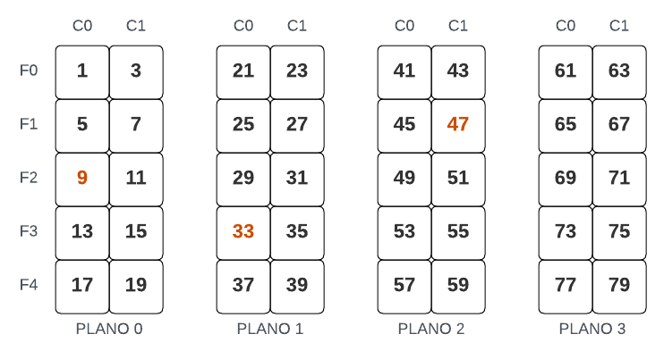
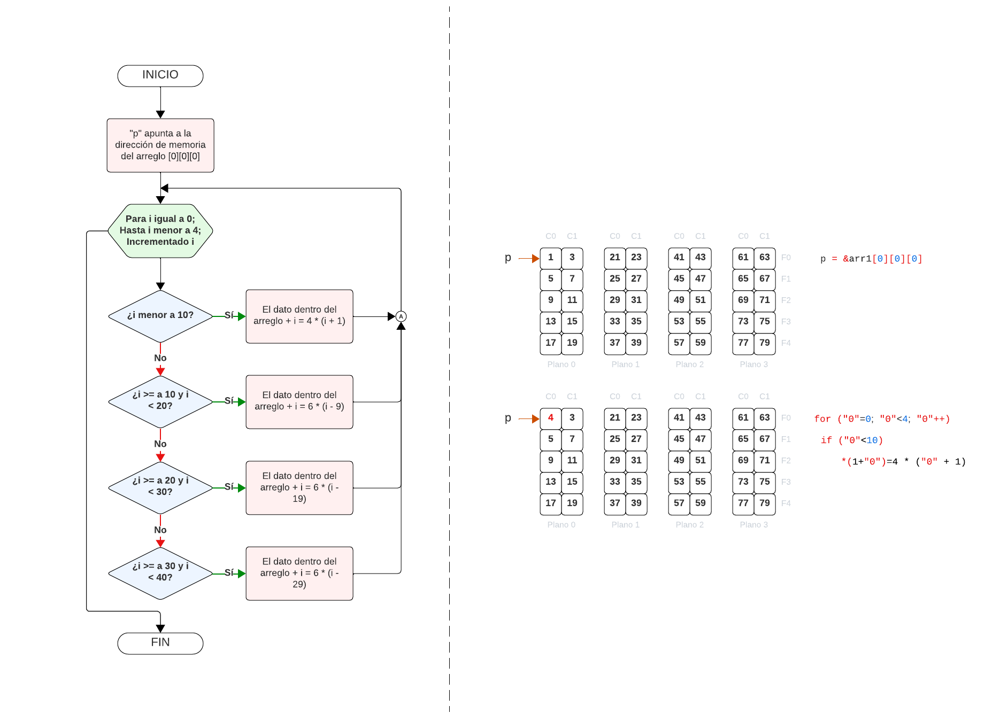

# EJERCICIO 3
```C
#include <stdio.h>

int arr1[4][5][2], var;
int *p;

int main(){
    p = &arr1[0][0][0];     // Apuntador p apunta a la dirección de memoria de arr1[0][0][0]
    var = 1;

    // Recorremos el arreglo de 3 dimensiones
    for (int i = 0; i < 4; i++){
        for (int j = 0; j < 5; j++){
            for (int k = 0; k < 2; k++){
                arr1[i][j][k] = var;
                var += 2;   // El arreglo aumenta su valor de  dos en dos hasta llenarse
            }
        }
    }

    // Realizamos operaciones con los apuntadores para visualizar los valores del arreglo
    // en la posición [0] + 4, [0] + 16 y [0] + 23.
    int a = *(p + 4);
    int b = *(p + 16);
    int c = *(p + 23);

    return 0;
}
```
Gracias al código anterior por favor realiza lo siguiente:

- Visualizar los valores de las operaciones y las tablas que dicho arreglo creo en primer instancia.
- Recorrer el arreglo con un solo "for" y llenar las tablas con nuevos valores.

## SOLUCIÓN
### Visualizar los valores de las operaciones.
Para poder visualizar el valor de las operaciones con apuntadores lo único que hay que hacer es utilizar nuestra función "printf debido a que
estamos igualando el valor de nuestras variables con el valor que tiene dentro la dirección de memoria del apuntador más la pisición que desamos
visualizar, entonces:
```C
    printf("Los valores son: %d, %d y %d", a, b, c);

    // Los valores son: 9, 33 y 47
```
Los valores que visualizaremos son los anteriores debido a que nuestro valor de la pisición "[0][0][0]" comenzara en en 1 y va a ir aumentando
de dos en dos.

### Visualizar las tablas de valores.
Para poder visualizar las tablas con sus valores correspondientes es necesario recurrir a las estructuras de control para que recorran nuestro
arreglo, para ello tendremos tres estructuras de control, una para los planos, para las filas y columnas, por lo tanto quedaría de la siguiente
manera:
```C
    // Imprimimos los valores del arreglo
    for(int i = 0; i < 4; i++){                 // "for" para recorrer el plano
        for(int j = 0; j < 5; j++){             // "for" para recorrer la fila
            for(int k = 0; k < 2; k++)          // "for" para recorrer la columna
                printf("[%d]" , arr1[i][j][k]);
            printf("\n");
        }
        printf("\n");
    }
```
Y tendremos lo siguiente:
<div>
    
</div>

### Modificar el arreglo.
Para poder modificar el arreglo con una sola estructura de control tendremos lo siguiente:
<div>
    
</div>

Su código es el siguiente:
```C
    /* Recorremos el arreglo para modificar los valores de la siguiente manera:
        - Plano 0: Valores multiplos de 4.
        - Plano 1: Valores multiplos de 6.
        - Plano 2: Valores multiplos de 7.
        - Plano 3: Valores multiplos de 5.
    */
    p = &arr1[0][0][0];    // Apuntador p apunta a la dirección de memoria de arr1[0][0][0]

    for(int i = 0; i < 40; i++){
        if(i < 10)
            *(p + i) = 4 * (i + 1);
        if(i >= 10 && i < 20)
            *(p + i) = 6 * (i - 9);
        if(i >= 20 && i < 30)
            *(p + i) = 7 * (i - 19);
        if(i >= 30 && i < 40)
            *(p + i) = 5 * (i - 29);
    }

    // Imprimimos los nuevos valores del arreglo
    for(int i = 0; i < 4; i++){
        for(int j = 0; j < 5; j++){
            for(int k = 0; k < 2; k++)
                printf("[%d]" , arr1[i][j][k]);
            printf("\n");
        }
        printf("\n");
    }
```
