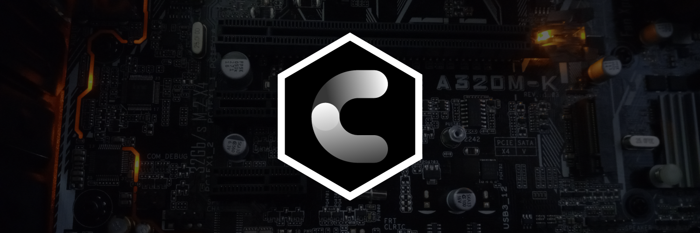

# PROGRAMACIÓN EN C :croissant:
<div>
    
</div>

```C
#include <stdio.h>
#include <stdlib.h>

void Saludo();

int main(){
    Saludo();
    return EXIT_SUCCESS;
}

void Saludo(){
    puts("Bienvenido a \"PROGRAMACIÓN EN C\"");
}
```
Sean bienvenidos al curso de progrmación en C, en esta parte podran visualizar desde los temas más básicos hasta los más avanazados para poder comenzar
a programar en C. Los temas abordados en esta carpeta son los siguientes:
<ul>
    <li><a href="00 - EJERCICIOS/00 - Ejercicios.md">00 - EJERCICIOS</a></li>
    <li><a href="01 - FUNDAMENTOS/00 - FUNDAMENTOS.md">01 - FUNDAMENTOS</a></li>
    <li><a href="02 - INTERMEDIO/00 - INTERMEDIO.md">02 - INTERMEDIO</a></li>
</ul>
