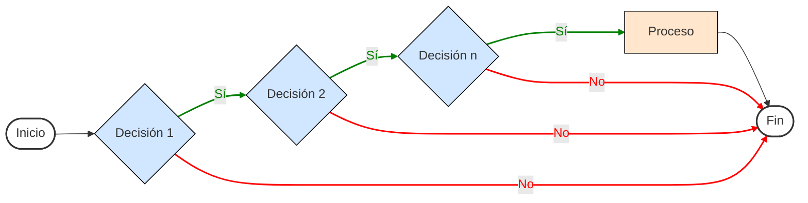
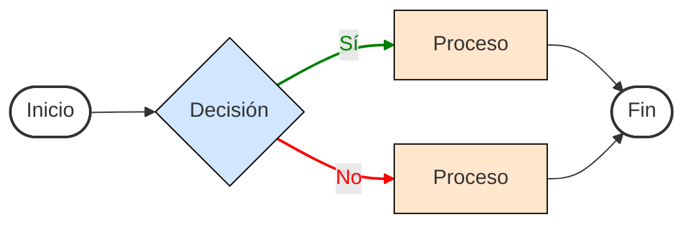
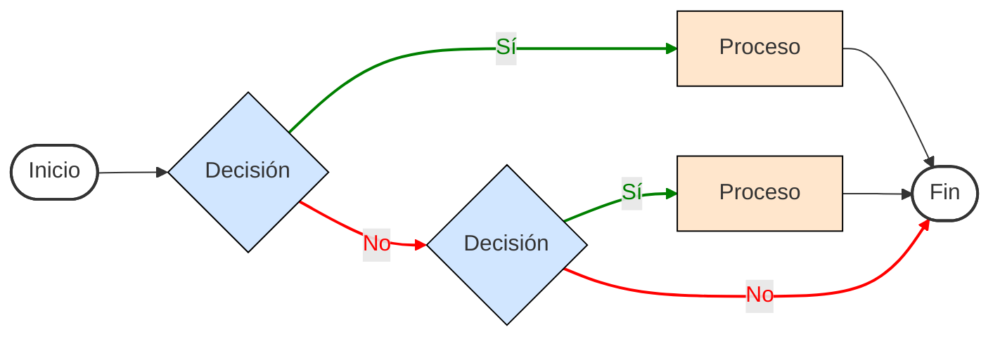

# ESTRUCTURAS CONDICIONALES :question:

Dentro de los lenguajes de programación en necesario tomar en cuenta las estructuras condicionales, dichas estructuras proporcionan soluciones para poder llevar a cabo tareas, rutinas u operaciones que se necesitan para dar solución a algún problema.

## [If.](./08%20-%2001%20-%20if.c)

La estructura condicional `if` (si) es la estructura condicional principal, esta estructura tiene como significado que, si cumple la condición establecida, el bloque de código o proceso dentro de ella se ejecutara, su diagrama de flujo y declaración están dados de la siguiente manera:

```C
if(condicion_a_cumplir) {
    /*
    ...
    Código a ejecutarse dentro de la condición
    ...
    */
}
```

``````mermaid
flowchart LR
    %% Definición de Nodos principales
    A([Inicio]) --> B{Decisión}
    B -- Sí --> C[Proceso]
    C --> D([Fin])

    %% Rutas de salida para el "No"
    B -- No --> D([Fin])

    %% Configuración de Estilos Profesionales
    classDef terminador fill:#ffffff,stroke:#333,stroke-width:2px;
    classDef decision fill:#d1e6ff,stroke:#000,stroke-width:1px;
    classDef proceso fill:#ffe6cc,stroke:#000,stroke-width:1px;

    %% Aplicación de clases a los nodos
    class A,D terminador;
    class B decision;
    class C proceso;

    %% Estilos de las flechas (Verde para Sí, Rojo para No)
    linkStyle 1 stroke:green,stroke-width:2px,color:green;
    linkStyle 3 stroke:red,stroke-width:2px,color:red;
``````

## [If's Anidados.](./08%20-%2002%20-%20ifs.c)

Un punto versátil que tiene la estructura condicional `if` es que se puede tener anidadas múltiples condiciones entre sí, esto quiere decir que se ejecutará la condición siguiente si se tiene una condición anterior a ella que se haya cumplido, su diagrama de flujo y declaración están dados de la siguiente manera:

```C
if(condicion_1_a_cumplir){
    // Proceso a realizar si se cumple la condición 1.
    if(condicion_2_a_cumplir){
        if(condicion_3_a_cumplir){
            // Proceso a realizar si se cumple la condición
        }
    }
}
```



## [If/Else.](./08%20-%2004%20-%20ifElse.c)

Está estructura se caracteriza por que al momento de no cumplirse la condición declarada está entrara a un segundo bloque de código que se ejecutara, dicho "sino" ejecutara una instrucción declarada por el programador, su diagrama de flujo y declaración están dados de la siguiente manera:

```C
if(condicion_a_cumplir) {
    // Proceso a realizar si se cumple la condición
}else{
    // Proceso a realizar sino se cumple la condición
}
```



## [If/Else/If.](./08%20-%2005%20-%20ifElseIf.c)

Las estructuras condicionales `if-else-if` o ***"sino si"***, son aquellas las cuales permiten realizar una condicional y si esta no se cumple entra a otro bloque de código el cual realiza una acción si no se cumple dicha condicional puede tener una segunda condicional, su diagrama de flujo y declaración están dados de la siguiente manera:

```C
if(condición_a_cumplir) {
    // Proceso a realizar si se cumple la condición
}else if(condición_a_cumplir) {
    // Proceso a realizar sino se cumple la condición
}
```


## [Operador ternario](./08%20-%2006%20-%20opTernario.c)

El operador ternario `?` no es una estructura de control en sí, sino, es un operador el cual permite traducir de manera más corta la estructura condicional `if-else`, su estructura es la siguiente:

```C
(condición_a_cumplir) ? expresion_1 : expresion_2;
```

El siguiente ejemplo permite utilizar el operador ternario para comparar dos números:

```C
int n = 0;

printf("De el numero a evaluar: "); scanf("%i", &n);

(n > 0) ? (puts("n > 0")) : (puts("n < 0"));

// De el numero a evaluar: [se ingresa 10]
// n > 0
```

## [#if/#endif](./08%20-%2007%20-%20ifEndif.c)

A diferencia del `if` común, `#IF - #ENDIF` es una directiva de preprocesador las cuales permiten crear bloques condicionales de compilación. Estas directivas permiten controlar la inclusión o exclusión de secciones de código en función de condiciones predefinidas durante el proceso de compilación, su estructura es la siguiente:

```C
#if expresión
    // Proceso a realizar si la expresión es verdadera
#endif
```

De igual manera que en las estructuras condicionales, `#if - #endif` puede integrar `else` utilizando la directiva `#else`, esto puede verse de la siguiente manera:

```C
#if expresión
    // Proceso a realizar si la expresión es verdadera
#else
    // Proceso a realizar si la expresión es falsa
#endif
```

A su vez, también es posible utilizar `if – else - if` con la peculiaridad que la directiva a utilizar es `#elif`.

```C
#if expresión_1
    // Proceso a realizar si la expresión_1 es verdadera
#elif expresión_2
    // Proceso a realizar si la expresión_2 es verdadera
#elif expresión_3
    // Proceso a realizar si la expresión_3 es verdadera
#elif expresión_n
    // Proceso a realizar si la expresión_n es verdadera
#else
    // Proceso a realizar si ninguna expresión es verdadera
#endif
```

De igual forma se tiene `ifdef` y `ifndef` que permiten comprobar si una macro esta o no definida.

```C
#ifdef DEBUG
    // Código que se incluye si DEBUG está definido
#endif

#ifndef RELEASE
    // Código que se incluye si RELEASE no está definido
#endif
```

Por lo regular este tipo de condicionales son utilizadas para archivos tipo header.

Regresar al menú anterior [click auí](../00%20-%20Fundamentos.md).

Regresar al inicio [click auí](../../Inicio.md).
