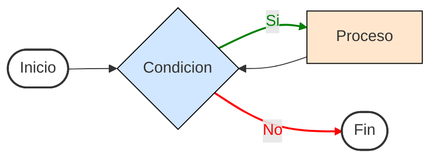
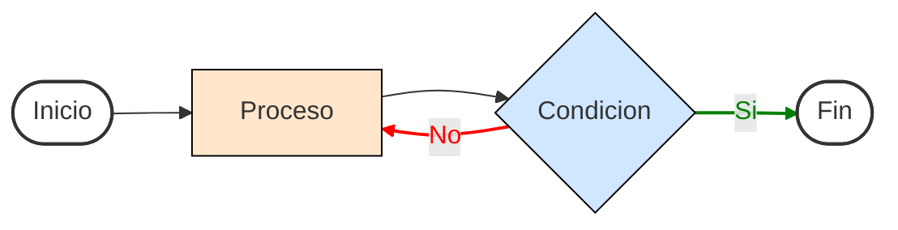
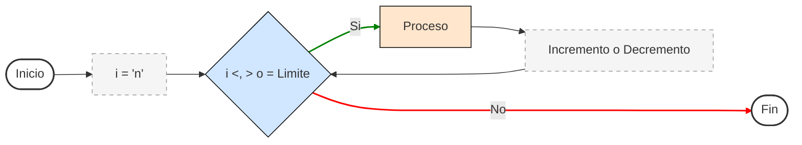
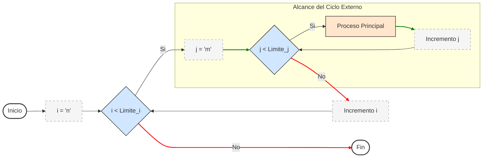
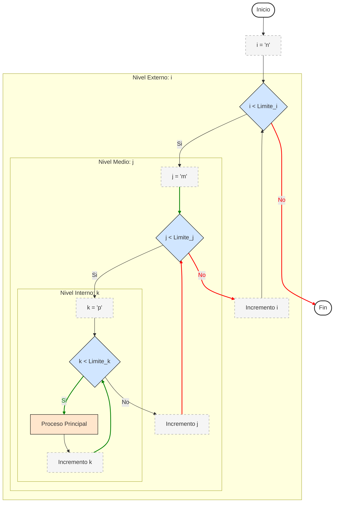

# ESTRUCTURAS DE CONTROL :military_helmet:

Las estructuras de control como su nombre lo dice, son estructuras que permiten realizar un control de una parte o bloques de código siempre y cuando se cumplan ciertas condiciones.

## [While](./10%20-%2001%20-%20while.c)

La estructura de control `while` (mientras) permite realizar una acción mientras se cumpla su condición inicial, su diagrama de flujo y declaración son:

```C
while(condicion_a_cumplir) {
    // Proceso ciclico a realizar si se cumple la condición
}
```



## [Do/While](./10%20-%2002%20-%20doWhile.c)

La estructura de control `do – while` (hacer mientras) a diferencia de la estructura de control `while`, realiza un bucle el cual se rompe si una condición dada por el programador o el usuario se cumple, su diagrama de flujo y declaración están dados de la siguiente manera:

```C
do {
    // Proceso ciclico a realizar si se cumple la condición
} while(condicion_a_cumplir);
```



## [For](./10%20-%2003%20-%20for.c)

El ciclo `for` (para) es un bucle el cual permite realizar un código para ciertas condiciones iniciales declaradas `n` número de veces.

Algo importante que destacar es que estos ciclos `for` permiten ingresar datos dentro de un arreglo de tamaño `n`, por lo cual para poder llenar dicho arreglo lo que se hace es que el ciclo o bucle recorre cada elemento del arreglo para poder llenarlo con su respectivo dato, su diagrama de flujo y declaración están dados de la siguiente manera:



Se puede observar que para poder utilizar un ciclo al menos en el lenguaje de programación C/C++ es necesario tener una variable la cual permite controlar dicho ciclo, la mayoría de las veces por convicción esta variable es llamada `i`, está `i` comenzara desde algún lugar y llega a otro, y siempre dará ciertos pasos, ya sea hacía atrás o hacía adelante.

```C
for(inicializacion; condicion; pasos){
    // ...
    // Código a ejecutarse dentro del ciclo
    // ...
}
```

## [For Anidados](./10%20-%2003%20-%20for.c)

Al igual que las estructuras condicionales `if`, los ciclos `for` de igual manera pueden ser anidados, su diagrama de flujo y declaración están dados de la siguiente manera:

- Dos ciclos for anidados:




- Tres ciclos for anidados:



```C
for(inicializacion_1; condicion_1; pasos) {
    for(inicializacion_2; condicion_2; pasos) {
        for(inicializacion_n; condicion_n; pasos) {
            // Código a ejecutarse dentro del ciclo “n”
        }
         // Código a ejecutarse dentro del ciclo 2
    }
     // Código a ejecutarse dentro del ciclo 2
}
```

Algo importante a denotar es que por convicción después de utilizar la variable `i` dentro de un ciclo se utilizara las siguientes letras del abecedario para poder utilizarlas en los otros ciclos (`j`, `k`, etc.).

Regresar al menú anterior [click auí](../00%20-%20Fundamentos.md).

Regresar al inicio [click auí](../../Inicio.md).
