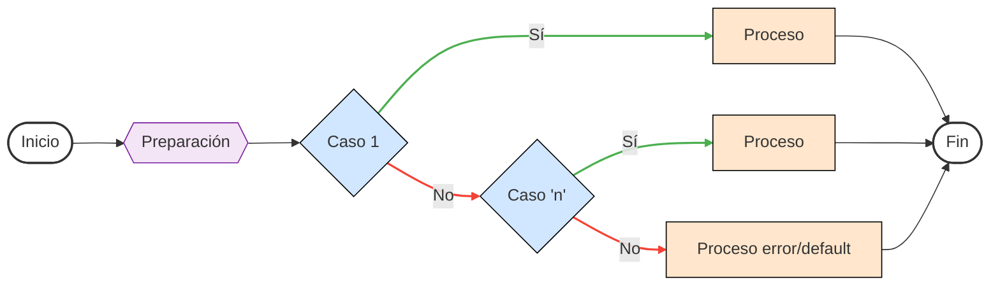

# ESTRUCTURAS DE SELECCION :question:

Las estructuras de selección `switch – case` a diferencia se la estructura condicional `if`, son estructuras las cuales tener múltiples casos y de estos múltiples casos poder seleccionar uno que cumpla la condición de dicho caso, una analogía muy utilizada en las estructuras de selección es la de un menú, su diagrama de flujo y declaración están dados de la siguiente manera:



```C
switch(preparacion){
    case 1: // Código case 1;
        break;
    // …
    case n: // Código case n;
        break;
    default: // Código default;
        break;
}
```

Código de ejemplo [click aquí](./08%20-%2001%20-%20switchCase.c).

Regresar al menú anterior [click auí](../00%20-%20Fundamentos.md).

Regresar al inicio [click auí](../../Inicio.md).
