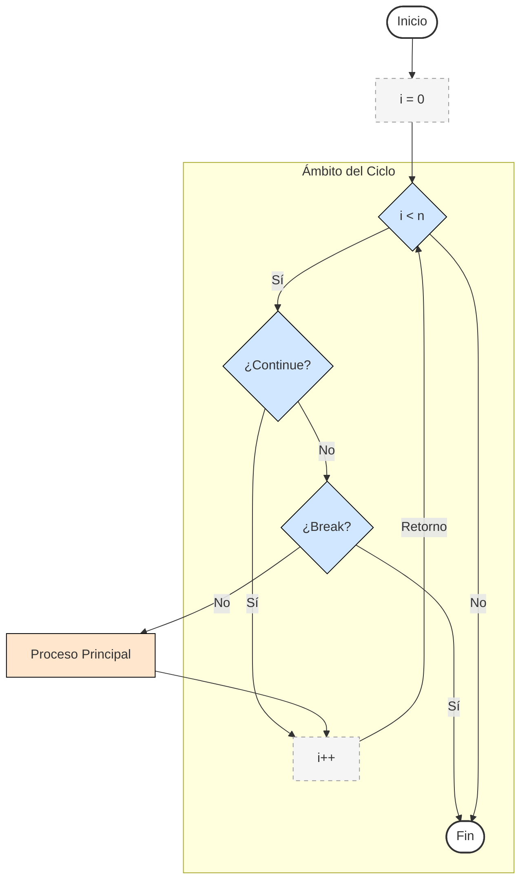

# BREAK Y CONTINUE :croissant:

`break` y `continue` actúan como sentencias de control dentro del código, ya que estas dos sentencias permiten tanto terminar/romper o continuar una secuencia de comandos dentro del código.

## Break

Terminan una iteración (repetición) dada por el programa y de igual manera rompe el ciclo completo dentro del programa o sección de código en cuestión (termina el programa).

## Continue

Terminan una iteración (repetición) y pasa a la siguiente iteración en seguida a la terminada, en sí, rompe el programa o sección de código en el sector indicado y lo siguiente después de ese sector (no termina el programa).

Código de ejemplo [click aquí](./09%20-%2001%20-%20breakContinue.c).

Regresar al menú anterior [click auí](../00%20-%20Fundamentos.md).

Regresar al inicio [click auí](../../Inicio.md).
