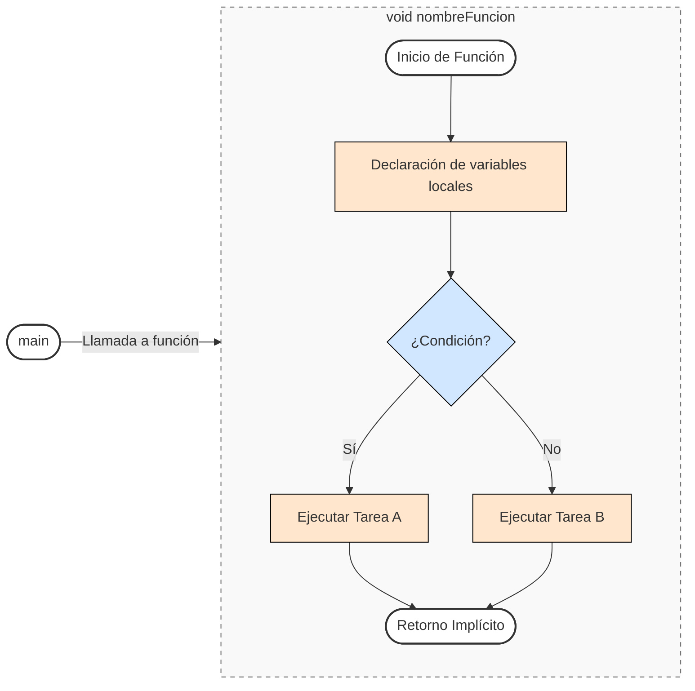
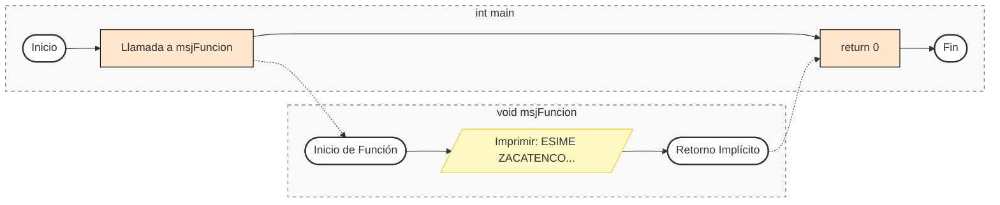
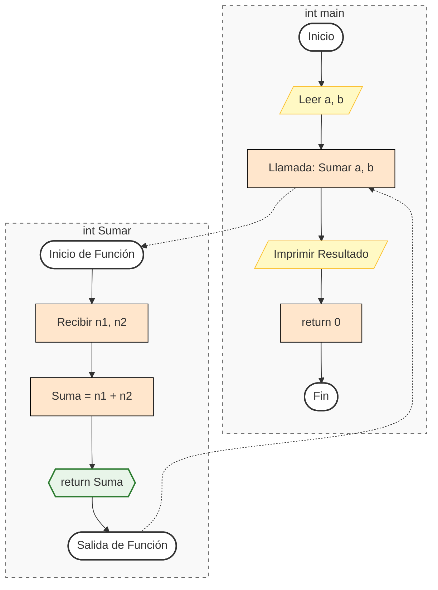

# FUNCIONES EN C :package:

Las funciones dentro de la programación son una parte más que importante, se puede decir que una función proporciona una forma conveniente de encapsular datos y cálculos que se pueden emplear después sin preocuparse de su implementación. Con funciones que se diseñen adecuadamente, es posible ignorar el cómo se realiza el trabajo, si no, es suficiente saber que se hace.
Se pueden declarar funciones dentro del lenguaje de programación C de la siguiente manera:

```C
// DIRECTIVAS DE PREPROCESADOR
#include <stdio.h>

// PROTOTIPO(S) DE FUNCION(ES)
tipoFuncion nombreDeLaFuncion(Parametros);

// FUNCIÓN PRINCIPAL
int main(){
    // Código en C
    return 0;
}

// FUNCION(ES)
tipoFuncion nombreDeLaFuncion(Parametros){
    // Código en la función (instrucciones).
}
```

## [Funciones sin retorno](./10%20-%2001%20-%20FuncionesSinRetorno.c)

Una función sin retorno, como su nombre lo dice, es una función la cual no regresa ningún valor dentro de su encapsulado, está dada por:

```C
// DIRECTIVAS DE PREPROCESADOR
#include <stdio.h>

// PROTOTIPO(S) DE FUNCION(ES)
void nombreDeLaFuncion(Parametros);

// FUNCIÓN PRINCIPAL
int main(){
    // Código en C
    return 0;
}

// FUNCION(ES)
void nombreDeLaFuncion(Parametros){
    // Código en la función (instrucciones).
}
```




El siguiente ejemplo permite visualizar un texto en consola gracias a las funciones.

```C
// DIRECTIVAS DE PREPROCESADOR
#include <stdio.h>

// PROTOTIPO(S) DE FUNCION(ES)
void msjFuncion();

// FUNCIÓN PRINCIPAL
int main(){
    msjFuncion();
    return 0;
}
// FUNCION(ES)
void msjFuncion(){
    printf(“ESIME ZACATENCO | IPN | ICE | ELECTRÓNICA”);
}
```

Siendo su diagrama de flujo el siguiente:



## [Funciones con retorno](./10%20-%2002%20-%20FuncionesConRetorno.c)

Es una función la cual regresa algún valor dentro de su encapsulado, está dada por:

```C
// DIRECTIVAS DE PREPROCESADOR
#include <stdio.h>

// PROTOTIPO(S) DE FUNCION(ES)
tipoDato nombreDeLaFuncion(Parametros);

// FUNCIÓN PRINCIPAL
int main(){
    // Código en C
    return 0;
}
// FUNCION(ES)
tipoDato nombreDeLaFuncion(Parametros){
    // Código en la función (instrucciones).
}
```

El siguiente ejemplo permite realizar la suma de dos números gracias a las funciones.

```C
// DIRECTIVAS DE PREPROCESADOR
#include <stdio.h>

// PROTOTIPO(S) DE FUNCION(ES)
int Sumar(int n1, int n2);

// FUNCIÓN PRINCIPAL
int main() {
    int a, b;
    printf("De el 1er numero: "); scanf("%i", &a);
    printf("De el 2do numero: "); scanf("%i", &b);
    printf("La suma de %i y %i es: %i", a, b, Sumar(a, b));
    return 0;
}

// FUNCION(ES)
int Sumar(int n1, int n2) {
    int Suma = 0;
    Suma = n1 + n2;
    return Suma;
}
```

Siendo su diagrama de flujo el siguiente:




Regresar al menú anterior [click auí](../00%20-%20Fundamentos.md).

Regresar al inicio [click auí](../../Inicio.md).
