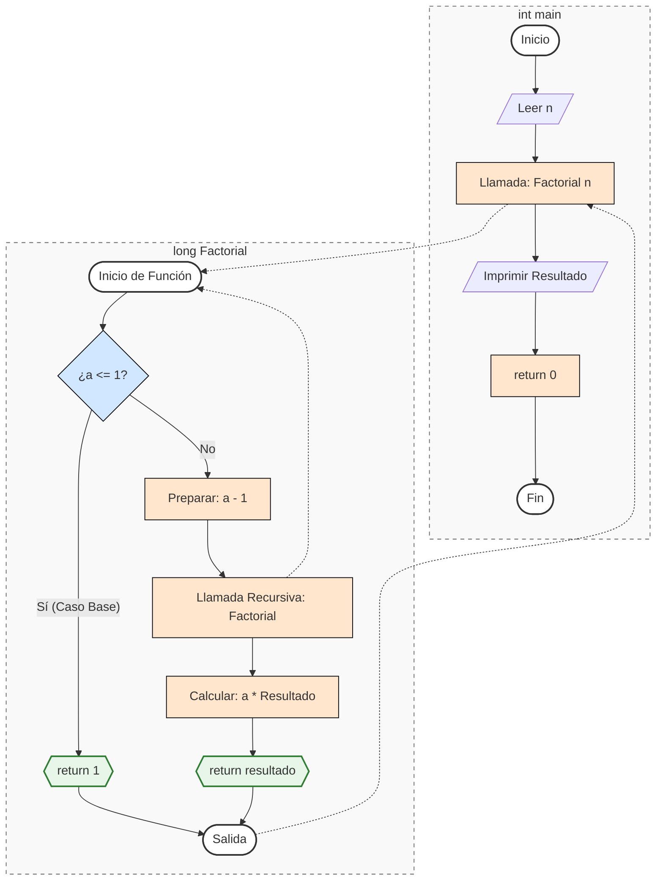
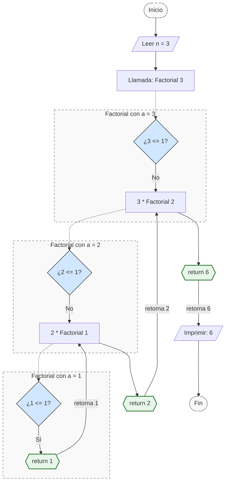
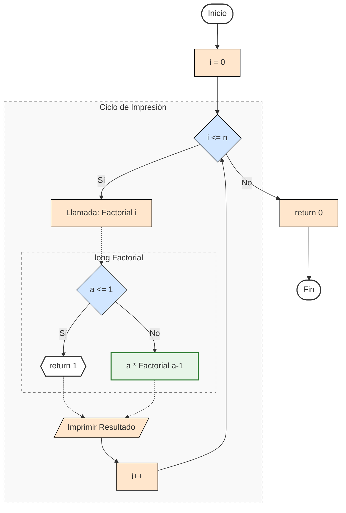

# FUNCIONES RECURSIVAS EN C :package:

Las funciones recursivas, como su nombre lo dice, son funciones que se vuelven a llamar o acuden a ellas de nuevo, es así que se tienen dos tipos de funciones en C, el caso "base" y el caso recursivo, la estructura de una función recursiva está dada por:

```C
// DIRECTIVAS DE PREPROCESADOR
#include <stdio.h>

// PROTOTIPO(S) DE FUNCION(ES)
tipoDato nombreDeLaFuncion(Parametros);

// FUNCIÓN PRINCIPAL
int main(){
    // Código en C
    return 0;
}

// FUNCION(ES)
tipoDato nombreDeLaFuncion(Parametros){
    nombreDeLaFuncion(Parametros);
    // Código en la función (instrucciones).
}
```

A continuación, el siguiente ejemplo permite visualizar la factorial de un número gracias a la recursividad de las funciones.

```C
// DIRECTIVAS DE PREPROCESADOR
#include <stdio.h>

// PROTOTIPO(S) DE FUNCION(ES)
long Factorial(int a);

// FUNCIÓN PRINCIPAL
int main(){
    int n;
    printf("Escriba un numero: "); scanf("%d", &n);
    printf("\nEl factorial de %d es: %d", Factorial(n));
    return 0;
}

// FUNCION(ES)
long Factorial(int a){
    if(a <= 1) return 1;
    else return (a * Factorial(a - 1));
}
```



El proceso del código es el siguiente para `n = 3`:



Se puede observar que en primera instancia se llama a la función factorial de 3, se evalúa el valor dado por el usuario dentro de ella y el valor dado por el usuario se multiplica por la función factorial de `3 - 1`, ósea, la función factorial de 2, al hacer esto es necesario calcular el factorial de 2 y a su vez, el factorial de 1, una vez calculados el factorial de `n - 1`  lo que se hace es multiplicar el resultado de cada factorial calculado por la función, siendo así que el factorial de 3 es igual a 6.

Ahora bien, si se desea visualizar los resultados de los números que participan activamente en dicha factorial, se hace lo siguiente:

```C
// DIRECTIVAS DE PREPROCESADOR
#include <stdio.h>

// PROTOTIPO(S) DE FUNCION(ES)
long Factorial(int a);

// FUNCIÓN PRINCIPAL
int main(){
    int n;
    printf("Escriba un numero: "); scanf("%d", &n);
    for(int i = 0;i <= n; i++){
        printf("\nEl factorial de %d es: %d", i, Factorial(n));
    }
    return 0;
}

// FUNCION(ES)
long Factorial(int a){
    if(a <= 1) return 1;
    else return (a * Factorial(a - 1));
}
```



Se puede observar que los códigos anteriormente vistos llaman a la función factorial y una vez hecho esto la misma función se llama a si misma para poder realizar las operaciones correspondientes dentro del programa.

Regresar al menú anterior [click auí](../00%20-%20Fundamentos.md).

Regresar al inicio [click auí](../../Inicio.md).
