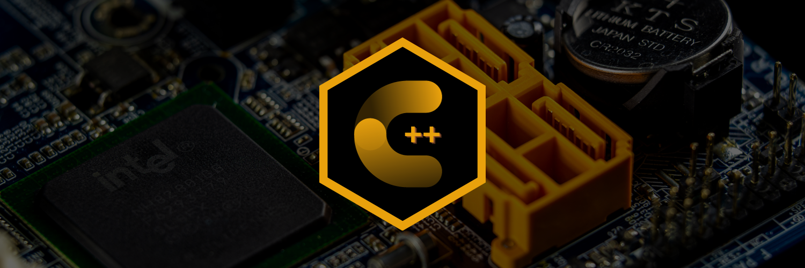

# PROGRAMACIÓN EN C++ :croissant: ++
<div>
    
</div>

```CPP
#include <iostream>

void Saludo();

int main(){
    Saludo();
    return 0;
}

void Saludo(){
    cout << "Bienvenido a \"PROGRAMACIÓN EN C++\"" << endl;
}
```
Sean bienvenidos al curso de progrmación en C++, en esta parte podran visualizar desde los temas más básicos hasta los más avanazados para poder comenzar
a programar en C++. Los temas abordados en esta carpeta son los siguientes: