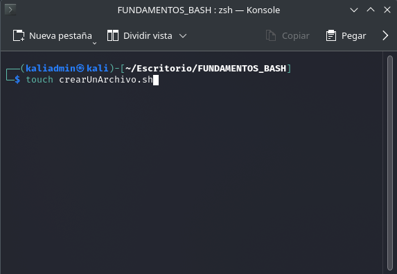
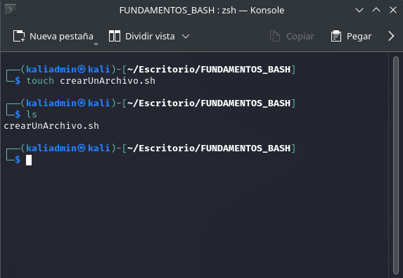
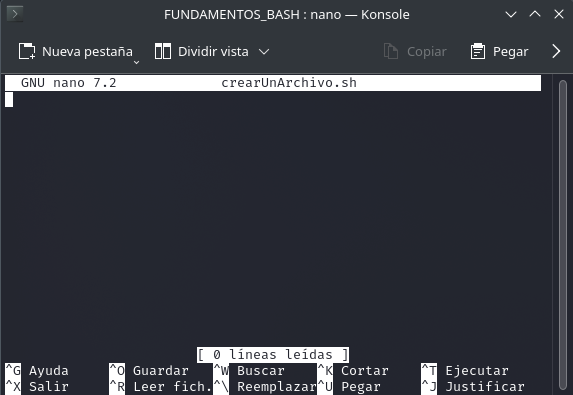

# CREACIÓN DE UN ARCHIVO TIPO SHELL :runner:
Para poder trabajar con nuestros scripts es necesario crear un archivo tipo shell (.sh) el cual nos permitira comenzar a trabajar, para ello abrimos
una nueva terminal y creamos nuestro primer archivo con los siguientes comandos:
```zsh
touch nombreDelArchivo.sh
```
Para poder editar nuestro archivo que acabamos de crear utilizaremos el editor de código que por defecto trae linux.
```zsh
nano nombreDelArchivo.sh
```
Lo anterior de manera practica puede observarse como:
<div>
    
</div>
Verificamos que si se creo el archivo:
<div>
    
</div>
Por último abrimos el editor de texto con nano:
<div>
    
</div>