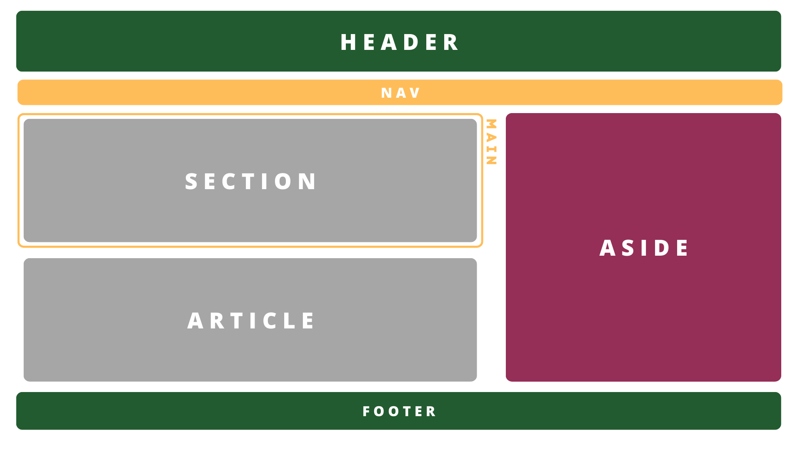

# FUNDAMENTOS HTML :runner:
## El rol de HTML :rocket:
Gracias a HTML es que podemos visualizar paginas web sin ningún problema, esto debido a que HTML es un lenguaje (no de programación) el cual funge como
esqueleto de nuestras paginas web, es por ello que HTML es HyperText Markup Language.

HTML al ser un lenguaje de etiquetas es muy facil de aprender, por ejemplo, una etiqueta de declara de la siguiente manera:
```html
<!-- <tipoEtiqueta> </tipoEtiqueta> -->
```

Tenemos las siguientes etiquetas basicas con sus respectivos significados:
```html
<p> <!-- = Párrafos -->
<nav> <!-- = Navegaciones -->
<header> <!-- = Encabezado del sitio o elemento -->
<main> <!-- = Contenido principal -->
<footer> <!-- = Pie de página o elemento -->
```

## Estructura báscia de HTML :construction:
La <a href="./01 - Estructura básica/index.html">estructura básica</a> de un documento HTML esta dada por:
```html
<html> <!-- Declaramos el documento HTML -->
    <head> <!-- Información y metadatos de nuestra página web -->
        <title>ESIME Z - IPN</title> <!-- Titulo de nuestra página web -->
    </head>
    <body> <!-- Cuerpo de la página web -->
        <!-- Contenido de la página web -->
        <p>Contenido</p>
    </body>
</html>
```
<b>NOTA.</b> Podemos generar la estructura básica en html escribiendo lo siguiente: <b><i>html:5</b></i>

## Headings :headstone:
Hemos dicho que dentro de HTML tenemos varías etiquetas, entre ellas estan las etiquetas de encabezado las cuales como su nombre lo dice, son etiquetas
para encabezados o titulos, estos headings se declaran de la siguiente manera:
```html
<h1>Titulo principal de la página</h1> <!-- Tambien puede subdividir secciones de la página -->
<h2>Encabezado secundario</h2>
<h3>Titulos dentro de secciones</h3>
<h4>Subtitulos dentro de secciones/h4> <!-- h4, h5 y h6 tienen el mismo uso -->
<h5> </h5>
<h6> </h6>
```
Estos headings le indican al navegador que lo que va dentro de ellos es lo más importante del sitio web, pueden ser logotipos o el nombre de sitio web.
La importancia de estos headings van en cascada, siendo el <b><i>h1</b></i> el más importante, despues el <b><i>h2</b></i>, y así sucesivamente.

<b>NOTA.</b> Una regla es que solo podemos utilizar el <b><i>h1</b></i> una vez por archivo.

## Estructura del contenido :classical_building:
El estructurar nuestro contenido en HTML significa etiquetar cada parte de nuestra página web en el lugar donde corresponde, algo importante a recalcar
es que dentro de esta estreuctura de páginas web tenemos tres secciones en común para todos los sitios web, el header, footer y la sección de navegación,
lo único que cambia es la parte del contenido.
HTML nos proporciona una serie de etiquetas para poder estructurar nuestro contenido, estas etiquetas son:
```html
<header> <!-- = Encabezado del sitio o elemento -->
<nav> <!-- = Navegaciones -->
<main> <!-- = Contenido principal -->
<section> <!-- = Sección dentro del contenido principal (Puede utilizarse multiples veces) -->
<article> <!-- = Notcias o entradas de información -->
<aside> <!-- = Barra lateral -->
<div> <!-- = Contenedor de contenido generico -->
<footer> <!-- = Pie de página o elemento -->
```
Esto puede verse el nuestra página web de la siguiente manera:



Y en código puede verse de la siguiente manera: <a href="./02 - Mi primer pagina web/index.html">estructura del contenido</a>

Podemos observar que en el código utilizamos un <b><i>section</b></i>, para poder utilizar esta etiqueta debemos seguir la siguiente regla: si el elemento hijo (etiqueta
dentro del section) es un heading, siempre utilizaremos un section. A excepción de que si el elemento hijo es el contenido principal utilizaremos una
etiqueta <b><i>main</b></i>.

## Enlaces y navegación :chains:
Dentro de HTML podemos ingresar a diferentes partes, páginas o secciones, esto gracias a los enlaces de navegación que podemos utilizar, estos enlaces se
pueden declarar de igual manera con etiquetas y tienen diferentes atributos. Declaramos nuestra etiqueta de enlaces de la siguiente manera:
```html
<a> </a> <!-- = Etiqueta de enlace -->
```
Cuando tenemos una sección de navegación de un solo nivel tenemos lo siguiente:
```html
<nav>
    <a> </a> <!-- Enlace 1 -->
    <a> </a> <!-- Enlace 2 -->
    <a> </a> <!-- Enlace 3 -->
    ...
    <!-- Enlace n -->
</nav>
```
Cuando tenemos barras de navegación de multinivel se declaran los enlaces de la siguiente manera:
```html
<nav>
    <ul>
        <li><a> <a/></li> <!-- Enlace 1 -->
        <li><a> <a/></li> <!-- Enlace 2 -->
        <li><a> <a/></li> <!-- Enlace 3 -->
        ...
        <!-- Enlace n -->
    </ul>
</nav>
```
Hemos dicho que estos enlaces tienen atributos, el más importante y obligatorio de estos es el <b><i>href</b></i>, esto debido a que con el definimos la URL o drección
a la cual deseamos acceder:
```html
<a href="http://www.ejemplo.com">Visitar sitio web</a> <!-- Enlace a página web -->
<a href="#seccion">Ir a la sección</a> <!-- Enlace a una ubicación dentro del mismo documento -->
<a href="mailto:ejemplo@dominio.com">Enviar correo</a> <!-- Enlace a una dirección de e-mail -->
<a href="rutaDelArchivo.extencion" dowload>Descargar archivo</a> <!-- Enlace de descarga -->
<a href="#" title="Enlace a una página interna">Información emergente</a> <!-- Enlace con informacón emergente -->
```
A parte del <b><i>href</b></i>, tenemos otros atributos tales como <b><i>target</b></i>, <b><i>title</b></i>, <b><i>download</b></i>, <b><i>rel</b></i>, <b><i>type</b></i>, <b><i>tabindex</b></i> y <b><i>accesskey</b></i>, a continuación veremos como utilzarlos:
```html
<!-- TARGET -->
<a href="http://www.ejemplo.com" target="_blank">Abrir enlace en una nueva ventana</a>
<a href="http://www.ejemplo.com" target="_self">Abrir enlace en la misma ventana (predeterminado)</a>
<a href="http://www.ejemplo.com" target="_parent">Abrir enlace en el marco principal</a>
<a href="http://www.ejemplo.com" target="_top">Abrir enlace en la ventana principal del navegador</a>

<!-- TITLE -->
<a href="#" title="Enlace a una página interna">Información emergente</a>

<!-- DOWNLOAD -->
<a href="rutaDelArchivo.extencion" dowload>Descargar archivo</a>

<!-- REL -->
<link rel="stylesheet" href="estilos.css">
<a href="https://www.ejemplo.com" rel="nofollow">Enlace sin seguimiento</a>

<!-- TYPE -->
<a href="documento.pdf" type="application/pdf">Descargar PDF</a>
<a href="mailto:ejemplo@dominio.com" type="text/plain">Enviar correo</a>

<!-- TABINDEX -->
<a href="#" tabindex="1">Primer enlace</a>
<a href="#" tabindex="2">Segundo enlace</a>
<input type="text" tabindex="3">

<!-- ACCESSKEY -->
<a href="#" accesskey="b">Ir a Blog</a>
<input type="text" accesskey="s">
```

## Imagenes :framed_picture:
Dentro de HTML podemos agregar imagenes las cuales pueden ser desde archivos locales o links que hagan referencia a imagenes almacenadas en páginas web, lo
que nosotros haremos será utlizar un servicio denominado <a href="https://tablericons.com/">tabler icons</a> para utilizar iconos de tipo SVG (scalable vector graphic).
Para poder mostrar imagenes utilizamos la siguiente etiqueta:
```html
 <!-- Esta etiqueta no tiene cierre -->
```
Y al igual que los enlaces, esta etiqueta tiene atributos los cuales son:
```html
<!-- SRC -->
 <!-- Atributo obligatorio -->

<!-- ALT -->
 <!-- Se muestra si la imagen no carga -->

<!-- WIDTH Y HEIGHT -->
 <!-- Esecifian el ancho y alto de la imagen (cm, px, etc) -->

<!-- TITLE -->


<!-- LOADING -->
 <!-- Controla cómo se carga la imagen (lazy/eager) -->
```
Si deseamos utilizar SVG's lo único que tenemos que hacer es copiar y pegar el link que nos proporciona la aplicación o página dentro del código de la
siguiente manera:
```html
<svg xmlns="http://www.w3.org/2000/svg" class="icon icon-tabler icon-tabler-ufo" width="40" height="40" viewBox="0 0 24 24" stroke-width="2" stroke="#00b341" fill="none" stroke-linecap="round" stroke-linejoin="round">
  <path stroke="none" d="M0 0h24v24H0z" fill="none"/>
  <path d="M16.95 9.01c3.02 .739 5.05 2.123 5.05 3.714c0 2.367 -4.48 4.276 -10 4.276s-10 -1.909 -10 -4.276c0 -1.59 2.04 -2.985 5.07 -3.724" />
  <path d="M7 9c0 1.105 2.239 2 5 2s5 -.895 5 -2v-.035c0 -2.742 -2.239 -4.965 -5 -4.965s-5 2.223 -5 4.965v.035" />
  <path d="M15 17l2 3" />
  <path d="M8.5 17l-1.5 3" />
  <path d="M12 14h.01" />
  <path d="M7 13h.01" />
  <path d="M17 13h.01" />
</svg>
```
