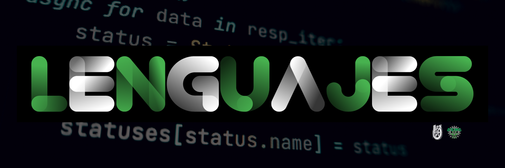

<div>
  
</div>
El repositorio aquí presente contiene los lenguajes de programación los cuales he aprendido, utilizado y que sigo aprendiendo
para la carrera en ingeniería en comunicaciones y electronica en la ESIME Zacatneco.

### :green_circle: <a href="01 - C/LEEME.md">Lenguaje C</a> [ :croissant: ]
### :green_circle: <a href="02 - C++/LEEME.md">Lenguaje C++</a> [ :croissant:++ ]
### :green_circle: <a href="03 - Matlab/LEEME.md">Matlab</a> [ :man_scientist: ]
### :yellow_circle: <a href="08 - uControladores/LEEME.md">uControladores</a> [ :computer: ]
### :yellow_circle: <a href="09-Android/LEEME.md">Desarrollo de aplicaciones moviles</a> [ :iphone: ]
### :yellow_circle: <a href="04 - Python/LEEME.md">Lenguaje Python</a> [ :snake: ]
### :yellow_circle: Lenguaje ensamblador (Proximamente en uControladores) [ :shield: ]
### :red_circle: <a href="06 - Bash/LEEME.md">Bash</a> [ :technologist: ]
### :red_circle: <a href="07 - Web/LEEME.md">Desarrollo Web</a> [ :spider_web: ]

## Clonar el repositorio :octocat:
Para poder clonar el repositorio es necesario abrir una terminal Git Bash y escribir el siguiente script:
```sh
git clone https://github.com/Jelp200/Lenguajes.git
```
